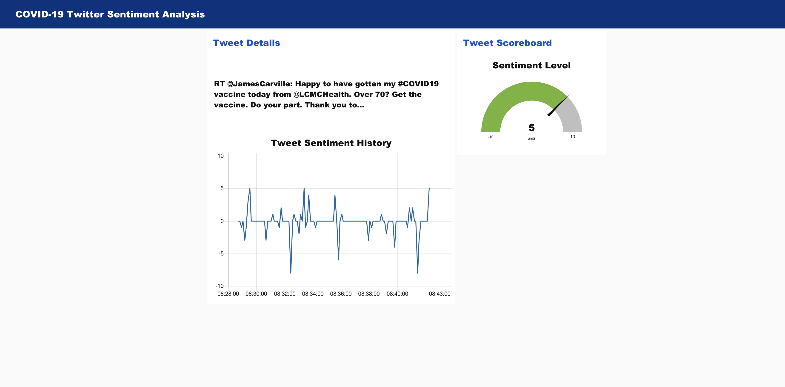

# Web Based Dashboard for COVID-19-Twitter-Sentiment-Analysis

The project mainly focuses on people’s sentiment towards the pandemic, understands the sentiments of people on government’s decisions to extend the lockdown and possibility to predict riots against the government.

In this Project, public Twitter feed corresponding to COVID-19 from around the globe  is extracted using realtime API calls . Each tweet received will be analyzed for emotional tone and sentiment, all data is stored in a Cloudant database, with the opportunity to store historical data as well. 

The dashboard had been built using Node-Red and Watson Tone Analyser supported by IBM Cloud

The resulting analysis is presented in a Node-Red based Web UI.

You can find the final project [here](https://covid19-twitter-sentiment-analysis.eu-gb.mybluemix.net/ui/#!/0?socketid=bV3Hp6429DQ91wssAAAD)
