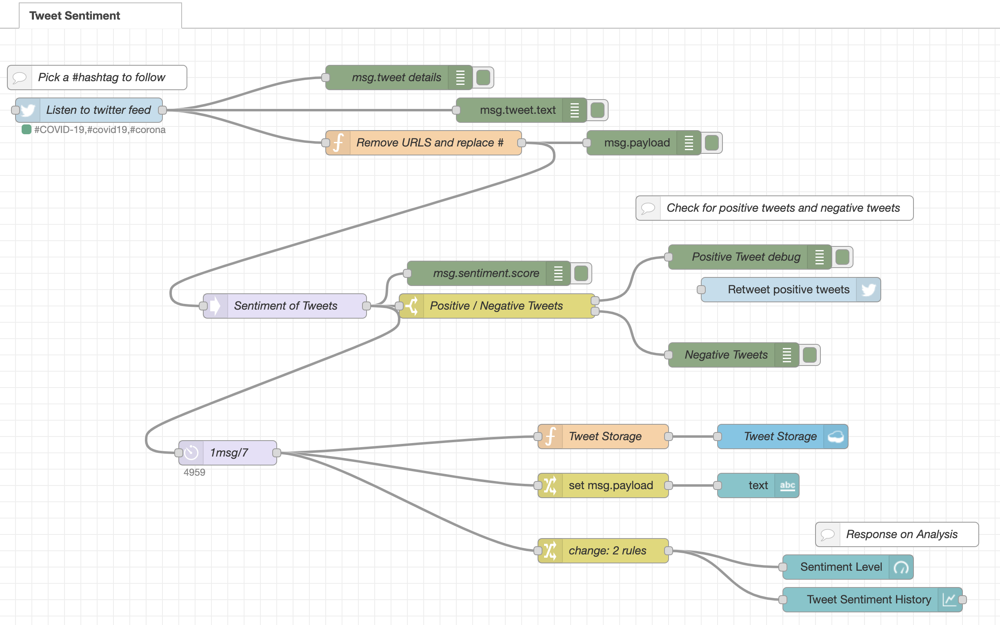

## Basic Workflow

The model has been built using Node-Red and Watson Tone Analyser collaborated by IBM Cloud. 

- Tweets are pushed out by Twitter based on Hashtag.
- The Watson Tone Analyzer Service /Sentiment node performs an analysis of sentiment and emotional tone.
- Tweets and metadata are stored in Cloudant
- The Web UI displays charts and graphs.

